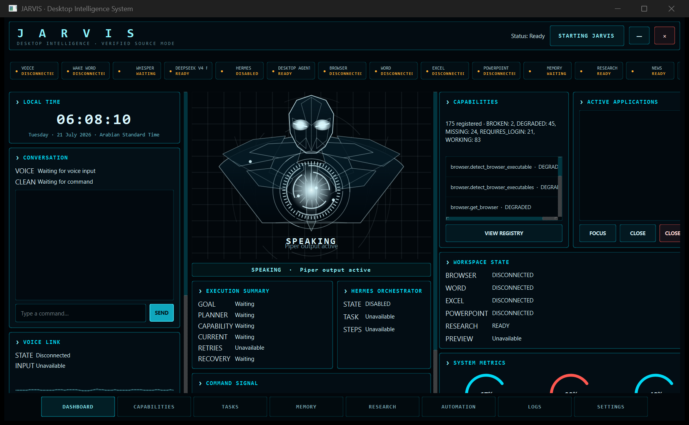
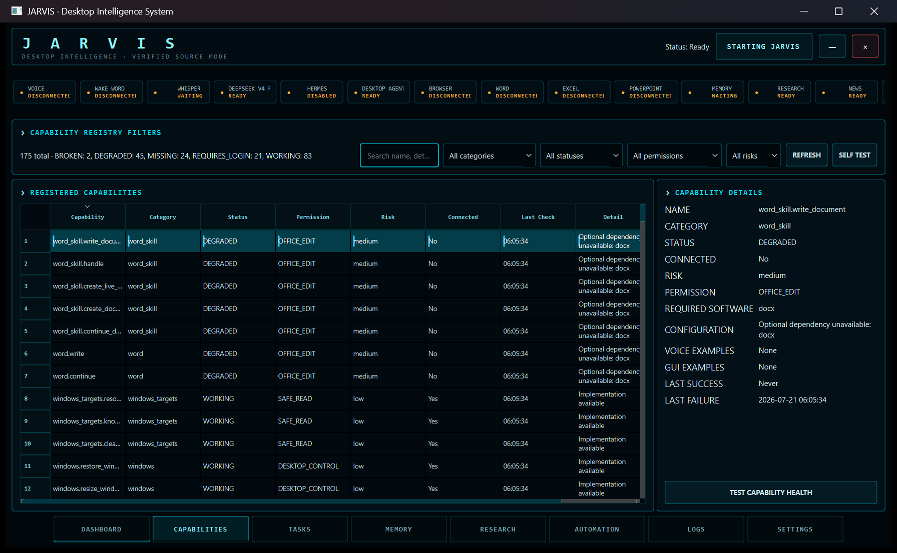

# JARVIS

### Local desktop intelligence for Windows

JARVIS is a cinematic, voice-enabled Windows desktop assistant that combines local speech and intent models with an optional OpenRouter-powered cloud model. It provides one interface for voice commands, application control, browser automation, Office workflows, research, email, media, system actions, and extensible skills.

> [!CAUTION]
> Never commit or share your `.env`, OpenRouter API key, email app password, private keys, browser profile, or other credentials. Local secrets and runtime data are excluded by this repository’s `.gitignore`.

## Screenshots

### Desktop dashboard



### Capability registry



## Features

- “Hey Jarvis” wake phrase with speech-to-text and text-to-speech support
- Fast rule-based command lane plus local Qwen intent routing
- Cinematic PySide6 dashboard with subsystem and capability health
- Windows application, window, volume, media, screenshot, and power controls
- Browser automation and web research workflows
- Gmail and WhatsApp drafting and automation with confirmation paths
- Word, Excel, and PowerPoint document generation
- News briefings, persistent memory, file search, and desktop organization
- Text-only and diagnostic modes for development and troubleshooting
- Extensible skill and capability registry

## Requirements

- Windows 11, 64-bit
- Python 3.11 or 3.12
- Microphone and speakers or headphones for voice mode
- Approximately 4 GB of free disk space for models and Chromium
- Internet access for initial downloads and network-backed features
- Optional OpenRouter API key for cloud conversation, drafting, and research

## Installation

Clone the repository and enter the project directory:

```powershell
git clone https://github.com/momorzq-oss/JARVIS.git
cd JARVIS
```

Create and activate a virtual environment:

```powershell
python -m venv .venv
.\.venv\Scripts\Activate.ps1
python -m pip install --upgrade pip
```

Install the CPU build of PyTorch first, followed by the project dependencies and Chromium:

```powershell
pip install torch==2.4.1 --index-url https://download.pytorch.org/whl/cpu
pip install -r requirements.txt
python -m playwright install chromium
```

If PowerShell blocks virtual-environment activation, run this once in the current terminal:

```powershell
Set-ExecutionPolicy -Scope Process Bypass
```

### Local configuration

Create a `.env` file in the project root. Add only the values you need:

```dotenv
OPENROUTER_API_KEY=your_key_here
OPENROUTER_MODEL=deepseek/deepseek-v4-flash
```

SMTP/IMAP fallback may additionally use `EMAIL_ADDRESS` and `EMAIL_APP_PASSWORD`. Keep all real values local. The application can run without OpenRouter, but cloud-backed features will be unavailable.

## How to run

Launch the desktop interface:

```powershell
python desktop_main.py --skip-model-preload
```

Launch the desktop interface with full model preloading:

```powershell
python desktop_main.py
```

Run the console assistant or text-only mode:

```powershell
python main.py
python main.py --text-only
```

Useful troubleshooting flags include `--debug` and `--skip-model-preload`.

Run the test suite with:

```powershell
python -m pytest
```

Build the Windows executable with:

```powershell
.\build_exe.bat
```

Build output is generated locally and is not stored in Git.

## Project structure

```text
JARVIS/
├── brain/              Local and cloud language-model routing
├── core/               Controller, capability, planning, and automation core
├── data/               Local runtime state; generated data is ignored
├── gui/                PySide6 desktop interface, themes, pages, and widgets
├── memory/             Memory package
├── screenshots/        Public interface screenshots used by this README
├── skills/             Browser, Office, media, research, and system skills
├── tests/              Unit, integration, routing, voice, and GUI tests
├── utils/              Shared utilities
├── voice/              Capture, wake word, speech recognition, and synthesis
├── config.py           Environment and path configuration
├── desktop_main.py     Desktop GUI entry point
├── main.py             Voice and text assistant entry point
└── requirements.txt    Pinned Python dependencies
```

## Current roadmap

- Improve noisy-room wake-word and barge-in accuracy
- Make browser, Gmail, and WhatsApp selectors more resilient to UI changes
- Expand intent coverage and multilingual command support
- Add guided first-run setup and clearer dependency diagnostics
- Increase unit, integration, safety, and hardware compatibility coverage
- Improve accessibility and responsive behavior on smaller displays
- Document the skill API and make third-party skill development easier

## Known issues

- Speaker echo can affect wake-word and “stop” detection; headphones work best.
- Gmail and WhatsApp automation may require updates when their interfaces change.
- WhatsApp automation requires the desktop application to be installed and linked.
- The small local router can misclassify uncommon wording.
- Initial setup is large because speech models, the router model, and Chromium are downloaded.
- Some capabilities depend on optional applications, credentials, hardware, or Windows permissions.
- The interface is optimized for larger desktop displays and needs more small-screen testing.

## Contributing

Issues, fixes, tests, and focused feature proposals are welcome.

1. Open an issue for substantial changes so the approach can be discussed.
2. Fork the repository and create a branch from `main`.
3. Keep changes focused and add or update relevant tests.
4. Run `python -m pytest` and report any checks that cannot run locally.
5. Audit your changes for secrets, personal data, logs, databases, generated files, and downloaded models.
6. Submit a pull request describing the problem, solution, testing, and user impact.

Do not place real credentials or private information in commits, issues, screenshots, fixtures, or pull requests.

## License

No open-source license has been selected yet. Until a license file is added, copyright remains with the repository owner and the code may be viewed and evaluated but is not automatically licensed for redistribution or commercial use.
